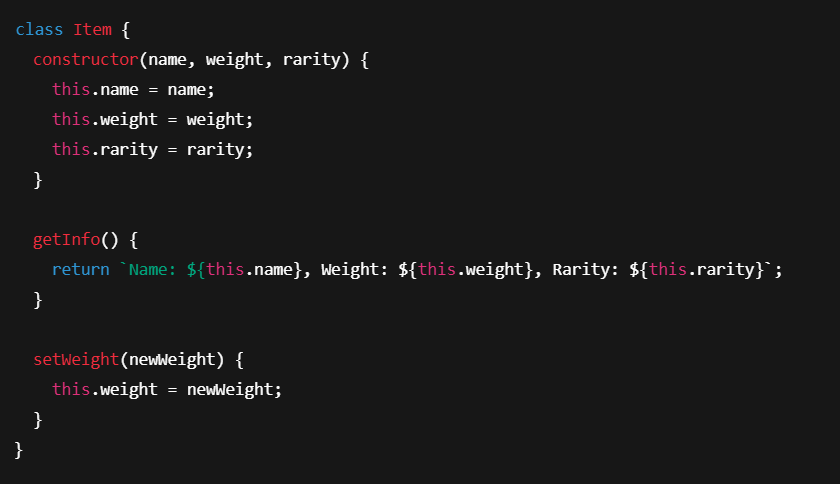
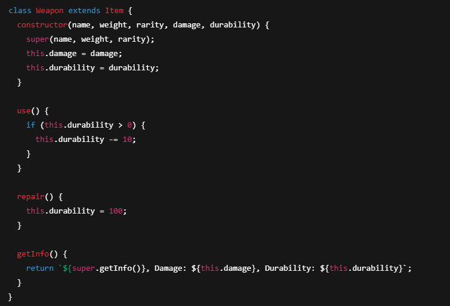
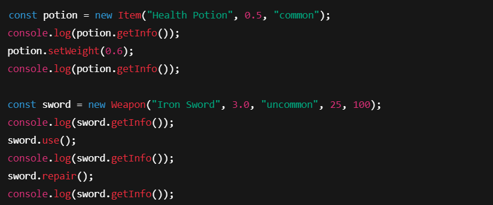
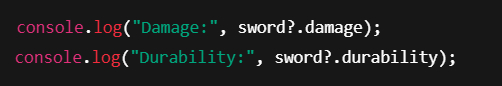
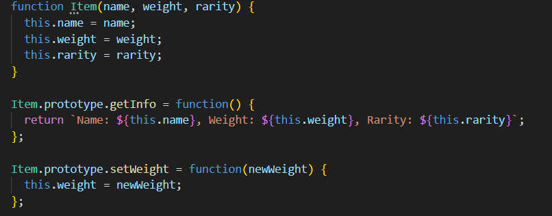
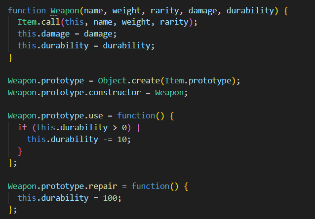
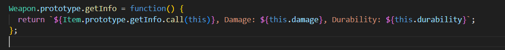
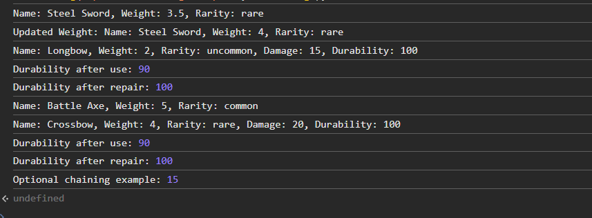

# Лабораторная работа №3. Продвинутые объекты в JavaScript

## Цель работы

Познакомиться с классами и объектами в JavaScript, научиться создавать классы, использовать конструкторы и методы, а также реализовать наследование.

## Условие

Создайте консольное приложение, моделирующее систему инвентаря, где можно добавлять предметы, изменять их свойства и управлять ими.

### Шаг 1. Создание класса `Item`

Создайте класс `Item`, который будет представлять предмет в инвентаре.

- **Поля класса**:
  - `name` – название предмета.
  - `weight` – вес предмета.
  - `rarity` – редкость предмета (`common`, `uncommon`, `rare`, `legendary`).
- **Методы**:
  - `getInfo()` – возвращает строку с информацией о предмете.
  - `setWeight(newWeight)` – изменяет вес предмета.



### Шаг 2. Создание класса `Weapon`

Создайте класс `Weapon`, который расширяет `Item`.

- **Дополнительные поля**:
  - `damage` – урон оружия.
  - `durability` – прочность (от 0 до 100).
- **Методы**:
  - `use()` – уменьшает `durability` на 10 (если `durability > 0`).
  - `repair()` – восстанавливает `durability` до 100.



### Шаг 3. Тестирование

1. Создайте несколько объектов классов `Item` и `Weapon`.
2. Вызовите их методы, чтобы убедиться в правильности работы.


### Шаг 4. Дополнительное задание

1. **Опциональная цепочка** `(?.)` – используйте ее при доступе к свойствам объекта, чтобы избежать ошибок.
    Пример использования опциональной цепочки:
    
2. **Создание функции-конструктора**:
   - Перепишите классы `Item` и `Weapon`, используя **функции-конструкторы** вместо `class`.
    Классы `Item` и `Weapon` переписанные через функции конструкторы:
    
    
    

<details>
  <summary>Весь код</summary>

<pre>```class Item {
  constructor(name, weight, rarity) {
    this.name = name;
    this.weight = weight;
    this.rarity = rarity;
  }

  getInfo() {
    return `Name: ${this.name}, Weight: ${this.weight}, Rarity: ${this.rarity}`;
  }

  setWeight(newWeight) {
    this.weight = newWeight;
  }
}

class Weapon extends Item {
  constructor(name, weight, rarity, damage, durability) {
    super(name, weight, rarity);
    this.damage = damage;
    this.durability = durability;
  }

  use() {
    if (this.durability > 0) {
      this.durability -= 10;
    }
  }

  repair() {
    this.durability = 100;
  }

  getInfo() {
    return `${super.getInfo()}, Damage: ${this.damage}, Durability: ${this.durability}`;
  }
}

function ItemConstructor(name, weight, rarity) {
  this.name = name;
  this.weight = weight;
  this.rarity = rarity;
}

ItemConstructor.prototype.getInfo = function() {
  return `Name: ${this.name}, Weight: ${this.weight}, Rarity: ${this.rarity}`;
};

ItemConstructor.prototype.setWeight = function(newWeight) {
  this.weight = newWeight;
};

function WeaponConstructor(name, weight, rarity, damage, durability) {
  ItemConstructor.call(this, name, weight, rarity);
  this.damage = damage;
  this.durability = durability;
}

WeaponConstructor.prototype = Object.create(ItemConstructor.prototype);
WeaponConstructor.prototype.constructor = WeaponConstructor;

WeaponConstructor.prototype.use = function() {
  if (this.durability > 0) {
    this.durability -= 10;
  }
};

WeaponConstructor.prototype.repair = function() {
  this.durability = 100;
};

WeaponConstructor.prototype.getInfo = function() {
  return `${ItemConstructor.prototype.getInfo.call(this)}, Damage: ${this.damage}, Durability: ${this.durability}`;
};

const sword = new Item("Steel Sword", 3.5, "rare");
console.log(sword.getInfo());
sword.setWeight(4.0);
console.log("Updated Weight:", sword.getInfo());

const bow = new Weapon("Longbow", 2.0, "uncommon", 15, 100);
console.log(bow.getInfo());
bow.use();
console.log("Durability after use:", bow.durability);
bow.repair();
console.log("Durability after repair:", bow.durability);

const axe = new ItemConstructor("Battle Axe", 5.0, "common");
console.log(axe.getInfo());

const crossbow = new WeaponConstructor("Crossbow", 4.0, "rare", 20, 100);
console.log(crossbow.getInfo());
crossbow.use();
console.log("Durability after use:", crossbow.durability);
crossbow.repair();
console.log("Durability after repair:", crossbow.durability);

console.log("Optional chaining example:", bow?.damage);```</pre>


</details>

## Выыод программы


## Документирование кода

Код должен быть корректно задокументирован, используя стандарт `JSDoc`. Каждая функция и метод должны быть описаны с указанием их входных параметров, выходных данных и описанием функционала. Комментарии должны быть понятными, четкими и информативными, чтобы обеспечить понимание работы кода другим разработчикам.

## Контрольные вопросы

1. Какое значение имеет `this` в методах класса?
Ответ:В методах класса this ссылается на текущий экземпляр объекта, через который вызывается метод.
2. Как работает модификатор доступа `#` в JavaScript?
Ответ:Модификатор # делает поле или метод приватным — они доступны только внутри класса и не видны снаружи.
3. В чем разница между `классами` и `функциями-конструкторами`?
Ответ:Классы — синтаксический сахар над функциями-конструкторами, обеспечивают более удобный и понятный способ создания объектов и наследования, но под капотом работают примерно одинаково.